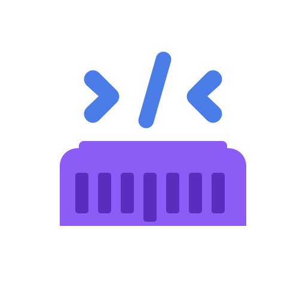
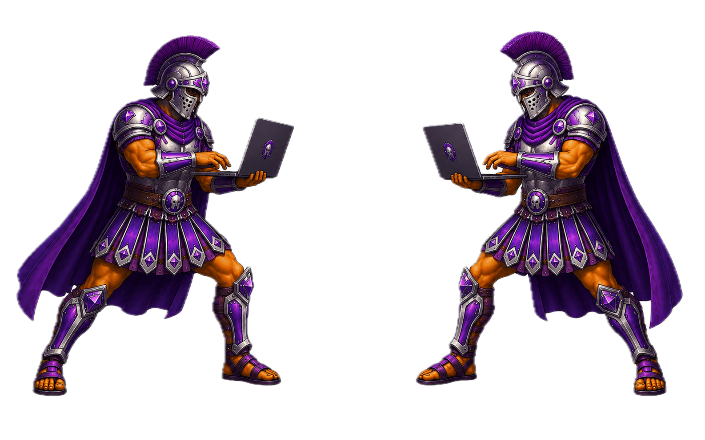
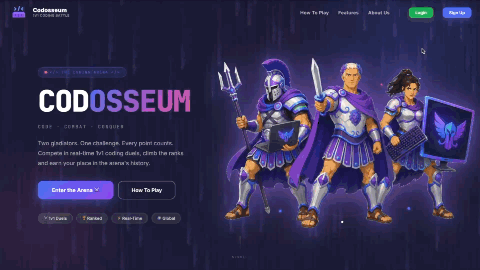
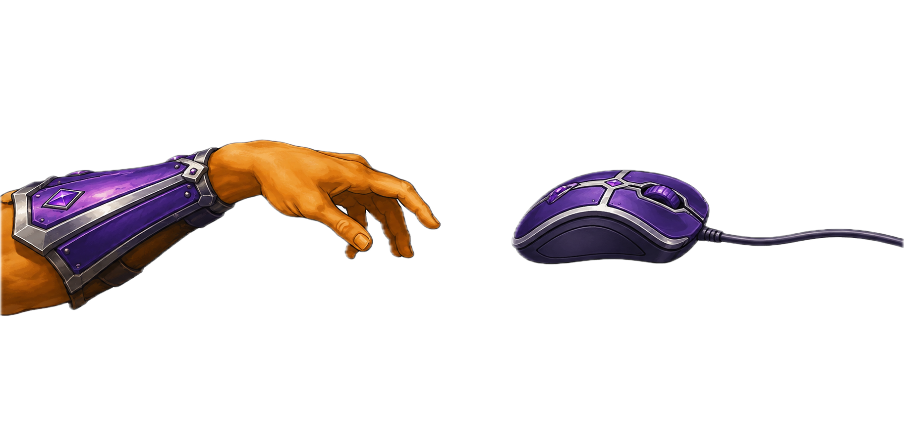
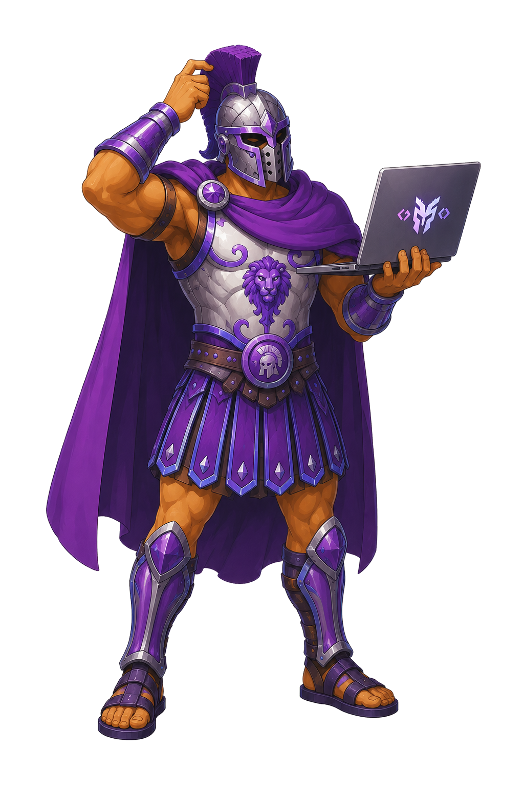
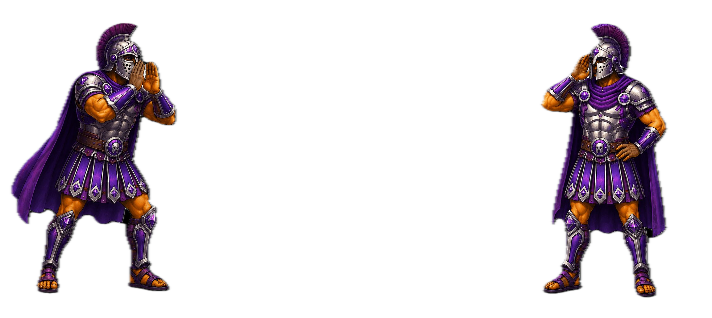
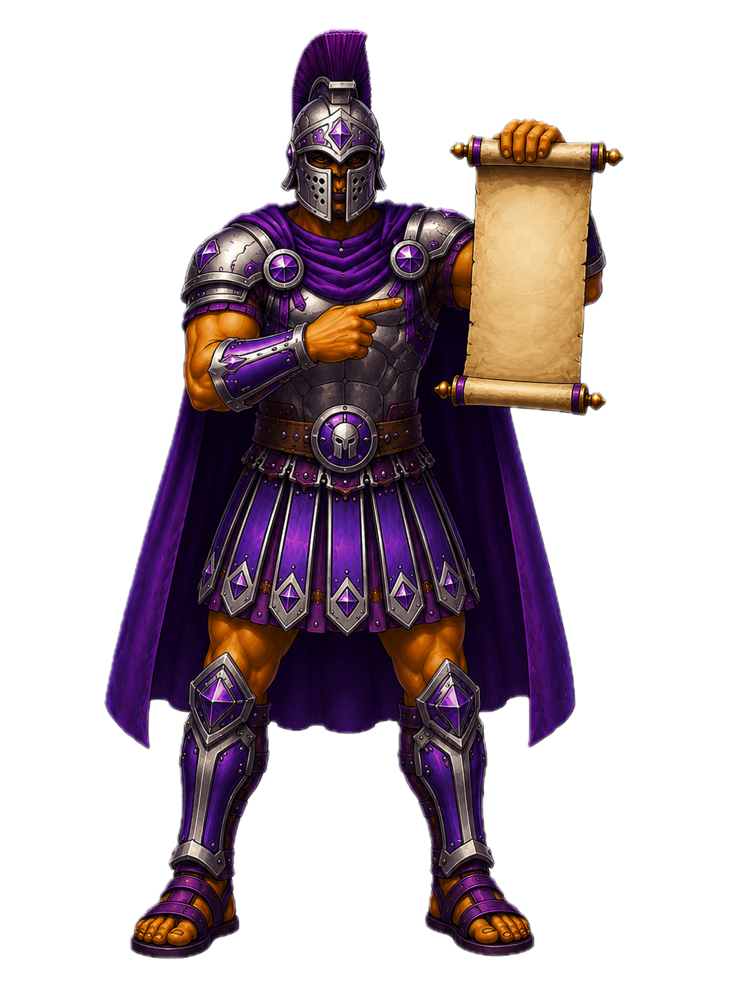

<p align="center"></p>

<div align="center">
  
  <h1>CODOSSEUM — Client</h1>
  <p><em>Two gladiators. One challenge.</em></p>
  <p>
    
    
    
    
    
  </p>
  <p>
    <a href="https://github.com/hamcoh/sopra-fs26-group-07-client">
      
    </a>
    &nbsp;
    <a href="https://github.com/hamcoh/sopra-fs26-group-07-server">
      
    </a>
    &nbsp;
    
    &nbsp;
    
  </p>
</div>

---

## ⚔️ About the Project



**Codosseum** is a real-time 1v1 competitive coding platform where two players go head-to-head solving programming challenges against the clock. Choose your language, enter the arena, and may the best coder win.

The platform supports two game modes:

- **⚡ Sprint Classic** — Race to solve all problems within 15 minutes. Most points wins.
- **🎮 Sprint Arcade** — Everything in Sprint Classic, plus an item shop. Earn coins by solving problems and spend them on sabotage items to disrupt your opponent.

<br clear="all" />

---

## 🎬 GameFlow

<p align="center"></p>

---

## ✨ Features
<p align="center"></p>
<div align="center">

| Feature | Description |
|---|---|
| 🔴 **Real-Time Battles** | WebSocket-based live 1v1 duels with instant state sync |
| 🏛️ **Game Lobby** | Lobby with live chat, room codes, and game configuration |
| 🛒 **Arcade Item Shop** | Buy Squid Ink, Earthquake, and Flip Screen to sabotage opponents |
| 💻 **Code Editor** | Syntax-highlighted editor with run, hint, and submit actions |
| 🌍 **Multi-Language** | Python, Java, and SQLite supported |
| 🏆 **Leaderboard** | Global rankings with win rates and stats |
| 📊 **Wrapped** | Season stats overview — wins, losses, top language, ranking |
| 👤 **Profiles** | Avatar selection, bio, password change, career statistics |
| 🎨 **Landing Page** | Live stats from the backend, animated Matrix rain effect |

</div>

---

## 🛠️ Tech Stack

```text
Framework      Next.js 15 (App Router) + Turbopack
Language       TypeScript 5
UI Library     Ant Design 6
Code Editor    CodeMirror via @uiw/react-codemirror
               └─ Language packs: Python · Java · SQL
Real-Time      STOMP over SockJS (@stomp/stompjs + sockjs-client)
Fonts          Inter (UI) · JetBrains Mono (code / accents)
```

---

## 🚀 Getting Started



### Prerequisites

- **Node.js** v18 or higher
- The [Codosseum backend server](https://github.com/hamcoh/sopra-fs26-group-07-server) running locally or deployed

### Installation

```bash
git clone https://github.com/hamcoh/sopra-fs26-group-07-client.git
cd sopra-fs26-group-07-client
npm install
```

### Environment Variables

Create a `.env.local` file in the project root:

```env
# Required for production deployments — omit for local development
# Local dev automatically targets http://localhost:8080
NEXT_PUBLIC_PROD_API_URL=https://your-backend-url.com
```

> In development mode the app always points to `http://localhost:8080`. No env file is needed for local development.

### Running Locally

```bash
# Start the development server (with Turbopack)
npm run dev
```

Open [http://localhost:3000](http://localhost:3000) in your browser.

```bash
# Production build
npm run build
npm run start
```

<br clear="all" />

---

## 🗺️ Application Routes
<p align="center"></p>
<div align="center">

| Route | Page | Auth Required |
|---|---|---|
| `/` | Landing page with live stats | No |
| `/login` | Login | No |
| `/register` | Registration + avatar selection | No |
| `/menu` | Main menu / dashboard | ✅ Yes |
| `/rooms` | Browse open game rooms | ✅ Yes |
| `/create-room` | Create a room with custom settings | ✅ Yes |
| `/join-room` | Join a room by 6-character code | ✅ Yes |
| `/rooms/[roomId]` | Game lobby with live chat | ✅ Yes |
| `/games/[gameSessionId]` | Live coding battle | ✅ Yes |
| `/profile` | User profile and career stats | ✅ Yes |
| `/changeavatar` | Change your gladiator avatar | ✅ Yes |
| `/changepassword` | Update your password | ✅ Yes |
| `/leaderboard` | Global leaderboard | ✅ Yes |
| `/wrapped` | Season stats overview | ✅ Yes |

</div>

---

## 📁 Project Structure

```
app/
├── (pages)/                  # All Next.js App Router pages
│   ├── page.tsx              # Landing page
│   ├── login/
│   ├── register/
│   ├── menu/
│   ├── rooms/
│   │   └── [roomId]/         # Game lobby
│   ├── create-room/
│   ├── join-room/
│   ├── games/
│   │   └── [gameSessionId]/  # Live game + hooks + components
│   ├── profile/
│   ├── changeavatar/
│   ├── changepassword/
│   ├── leaderboard/
│   └── wrapped/
│
├── components/               # Shared UI components
│   ├── CodosseumAvatar.tsx   # Avatar renderer (19 avatars)
│   ├── CodosseumLogo.tsx
│   ├── LandingIllustrations.tsx
│   ├── LoadingScreen.tsx
│   ├── MatrixCanvas.tsx      # Animated Matrix rain effect
│   ├── ProfileButton.tsx     # Top-right user menu
│   ├── SkipButton.tsx
│   ├── profile/              # Profile sub-components
│   └── register/             # Avatar selection component
│
├── hooks/                    # Custom React hooks
│   ├── useLocalStorage.tsx   # Persistent state with localStorage
│   ├── useAuth.ts            # Login / logout logic
│   ├── useUserProfile.ts     # Fetch and manage user profile
│   └── useApi.ts
│
├── styles/                   # CSS modules + global styles
│   └── landing.css           # Landing page global styles
│
└── utils/                    # Utility functions
    ├── domain.ts             # API base URL resolver
    ├── environment.ts        # Dev / prod detection
    └── uuid.ts
```

---

## 🔌 WebSocket Architecture

Real-time communication is handled via **STOMP over SockJS**.

<p align="center"></p>

<div align="center">

| Destination | Direction | Purpose |
|---|---|---|
| `/app/room/{roomId}/join` | Client → Server | Notify host a player joined |
| `/topic/room/{roomId}` | Server → Client | Room state updates (join/leave/close) |
| `/user/queue/game-start` | Server → Client | Game start signal + session data |
| `/topic/game/{id}/end` | Server → Client | Game over notification |
| `/app/room/{roomId}/send` | Client → Server | Lobby chat message |
| `/topic/chat/room/{roomId}` | Server → Client | Lobby chat broadcast |
| `/app/game/{id}/buy-item` | Client → Server | Purchase sabotage item |
| `/topic/game/{id}/sabotage` | Server → Client | Sabotage event (Arcade mode) |

</div>

---

## 👥 Team — Group #07

<div align="center">

| GitHub | Role |
|---|---|
| [@menthoos](https://github.com/menthoos) | Frontend |
| [@aldigi27](https://github.com/aldigi27) | Backend & Database |
| [@hamcoh](https://github.com/hamcoh) | Backend |
| [@clstein](https://github.com/clstein) | Frontend |
| [@supermqx](https://github.com/supermqx) | Backend & Judge Engine |

</div>

---

## 📄 License



This project is released under the [Apache 2.0 License](LICENSE), which permits free use, distribution, modification, and commercial use. The software is provided as-is, without warranty or liability of any kind.

<br clear="all" />
